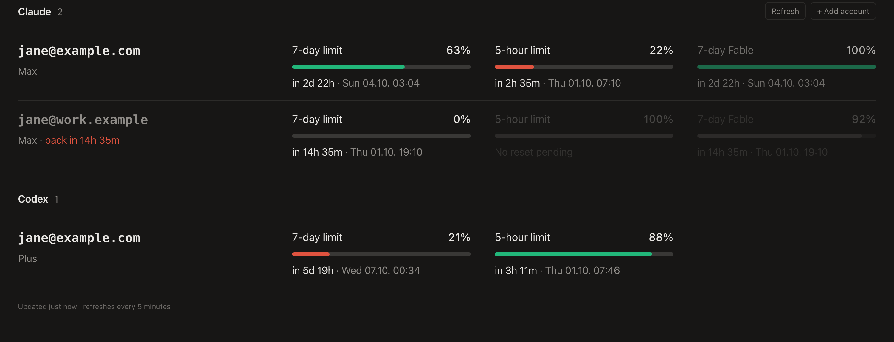

# Agents Monitor

A small macOS menu bar app that shows the remaining usage limits of every Claude Code, Codex, and
Grok login on your Mac: the 5-hour and 7-day windows, model-specific limits, Grok's weekly pool,
and exactly when each one resets.



- **Menu bar:** one small bar per account, filled to its lowest remaining limit. Green above 50%,
  orange down to 25%, red below that; a solid red bar means the account is currently blocked.
- **Popover:** every account with each limit's remaining percentage, the exact time until reset
  (`in 2d 22h · Sun 04.10. 03:00`) and, for blocked accounts, when you're back.
- **Multiple accounts:** add as many Claude Code config directories (`CLAUDE_CONFIG_DIR`), Codex
  homes (`CODEX_HOME`), and Grok config directories as you like from the popover. The default
  `~/.grok` login is added once, the first time it exists.

## Install

Requires macOS 14+ and Xcode's command line tools.

```sh
./build.sh --install
```

This builds a universal `Agents Monitor.app`, copies it to `~/Applications` and starts it. Tick
**Launch at login** in the popover to keep it running.

If you use a menu bar manager such as Ice, Bartender or Thaw, it may put the new item in its hidden
section. ⌘-drag it to the visible area once.

## How it works

The app reads the logins the CLIs already store and asks the same usage endpoints the CLIs use. It
never refreshes tokens itself, because that would rotate them behind the CLI's back. If a token has
expired, start that CLI once and the app picks up the new one.

| Provider | Credentials | Endpoint |
|---|---|---|
| Claude Code | macOS keychain: `Claude Code-credentials` for `~/.claude`, `Claude Code-credentials-<sha256(dir)[0:8]>` for any other config dir | `api.anthropic.com/api/oauth/usage` |
| Codex | `<CODEX_HOME>/auth.json` | `chatgpt.com/backend-api/wham/usage` |
| Grok | `<config dir>/auth.json` (default `~/.grok`) | `cli-chat-proxy.grok.com/v1/billing?format=credits` |

Keychain entries are read through `/usr/bin/security`, which Claude Code itself uses to write them,
so macOS doesn't prompt for access. Each account is polled every 5 minutes, with exponential backoff
on rate limits. Accounts and the last known usage are stored in
`~/Library/Application Support/AgentsMonitor/`.

The usage endpoints allow only a few requests per token. If another tool polls the same login
frequently, this app gets rate-limited for that account.

### Grok

The public xAI API (`api.x.ai`) still has no subscription-usage call. Rate-limit headers on an
inference request are per-minute API caps, not the SuperGrok weekly pool, and they carry no reset
time.

The grok CLI itself reads the pool from an undocumented proxy,
`GET /v1/billing?format=credits` on `cli-chat-proxy.grok.com`, with the OIDC token in `auth.json`
and the header `X-XAI-Token-Auth: xai-grok-cli`. The plan name comes from `GET /v1/settings`
(`subscription_tier_display`). xAI can change either route without notice. The app does not refresh
the token.

## Browser version

`npm start` serves the same dashboard at http://localhost:4747 without the menu bar app. It supports
Claude and Grok accounts and reads them from `accounts.json` (see `accounts.example.json`). Codex
stays in the menu bar app.

## Development

- `macos/Monitor.swift`: accounts, credentials and polling
- `macos/main.swift`: menu bar item, popover and the web view bridge
- `public/index.html`: the dashboard UI, shared by the app and the browser version
- `macos/make-icon.swift`: regenerates `macos/AppIcon.icns`

`build/Agents Monitor.app/Contents/MacOS/AgentsMonitor --snapshot out.png` renders the popover to a
PNG without opening any window.
